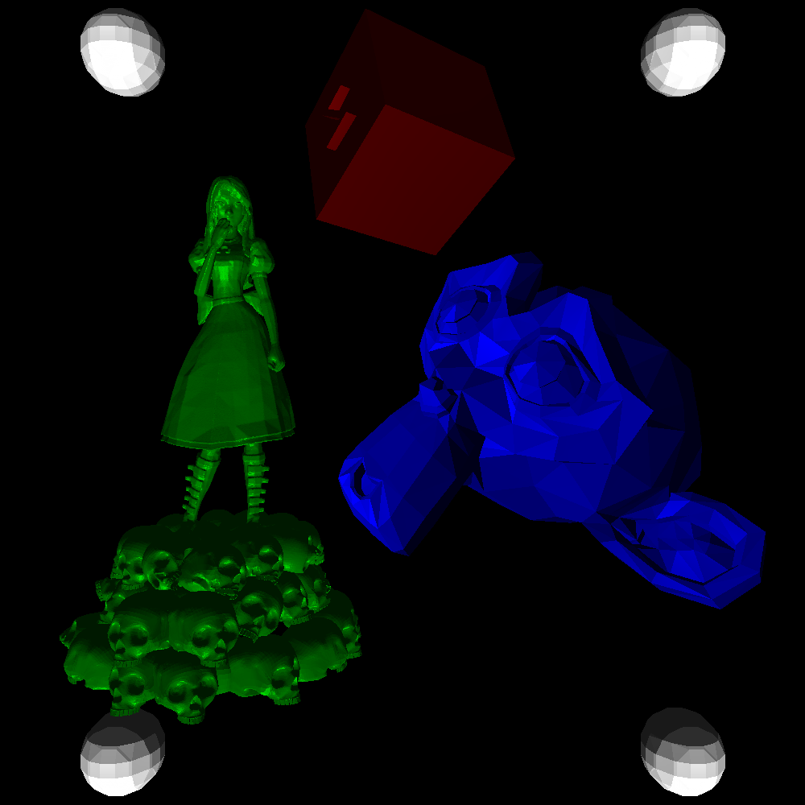

# Software Rasterization Toolkit
Software rasterizer written in C.

## Features
- File
    - Bitmap reader / ~~writer~~
    - STL reader / ~~writer~~
- 3DCG
    - Perspective camera
    - Rendering
        - Z-buffer (depth buffer)
    - Reflection model
        - Phong reflection model
        - Blinn phong reflection model
    - Shading
        - Flat shading
        - Gouraud shading
        - Phong shading
    - CSG
        - Primitives
            - Triangle
            - Plane
            - Cube
            - Cylinder
            - Triangular    
            - Ball
        - Operations
            - Union
            - ~~Difference~~ (NOT IMPLEMENTED, NEED HELP)
            - ~~Intersection~~ (NOT IMPLEMENTED, NEED HELP)
- Matrix
    - Transpose
    - Determinant
    - Inverse
    - Addition
    - Subtraction
    - Multiplication
    - Scalar addition
    - Scalar subtraction
    - Scalar multiplication
    - Scalar division
- Vector
    - Addition
    - Subtraction
    - Scalar addition
    - Scalar subtraction
    - Scalar multiplication
    - Scalar division
    - Cross product
    - Dot product
    - Euclidean norm
    - Euclidean distance
    - L2 normalization
    - Triangle: Check if vector is inside triangle?
    - Triangle: Normal vector
    - Triangle: Center of gravity
    - Barycentric coordinate

## Building all examples
```bash
git clone --recursive https://github.com/mikoim/software-rasterization-toolkit.git
cd software-rasterization-toolkit
cmake -DCMAKE_BUILD_TYPE=Release .
make
```

## Tips
### Export model from Blender
- File format: STL (**binary**)
- Forward: **X Forward**
- Up: **Y Up**

## Known issues
- clang may break ``PolygonCalculateVertexNormals``. (tested on 9.0.0)
- Sometimes, small gaps appear on polygons if the camera is right in front.

## Examples




### Video
#### Rendering polygon wire-frames
[here](examples/wireframe.mp4)

<video src="examples/wireframe.mp4" controls></video>
#### Comparing shading methods
[here](examples/shadings.mp4)

<video src="examples/shadings.mp4" controls></video>
#### Rendering world
[here](examples/world.webm)
[here](examples/phong.mp4)

<video src="examples/world.webm" controls></video>
<video src="examples/phong.mp4" controls></video>

## 3D models
- alice.stl (unknown author, license): "Alice and skulls free 3d model" http://3dmag.org/en/market/item/3861/
- ball.stl (Blender Foundation, unknown license): Primitives in Blender https://www.blender.org/
- box.stl (Blender Foundation, unknown license): Primitives in Blender https://www.blender.org/
- cone.stl (Blender Foundation, unknown license): Primitives in Blender https://www.blender.org/
- cube.stl (me, Public Domain)
- monkey.stl (Blender Foundation, unknown license): Primitives in Blender https://www.blender.org/
- plane.stl (Blender Foundation, unknown license): Primitives in Blender https://www.blender.org/

## External dependencies
- "exebook/hashdict.c: This is my REALLY FAST implementation of a hash table in C, in 150 lines of code." https://github.com/exebook/hashdict.c/

## References
- "Article - World, View and Projection Transformation Matrices" http://www.codinglabs.net/article_world_view_projection_matrix.aspx
- "CSCI-UA-0480-006 Special Topics: Computer Graphics " https://mrl.nyu.edu/~perlin/courses/spring2019/
- "graphics - How do you determine the view-up vector? - Stack Overflow" https://stackoverflow.com/questions/21467225/how-do-you-determine-the-view-up-vector
- "mtrebi/Rasterizer: CPU forward/deferred rasterizer with depth-buffering, texture mapping, normal mapping and blinn-phong shading implemented in C++" https://github.com/mtrebi/Rasterizer
- "OpenGL Projection Matrix" http://www.songho.ca/opengl/gl_projectionmatrix.html
- "Scratchapixel" https://www.scratchapixel.com/
- "Tutorial 12 - Perspective Projection" http://ogldev.org/www/tutorial12/tutorial12.html
- "Understanding the View Matrix" https://www.3dgep.com/understanding-the-view-matrix/
