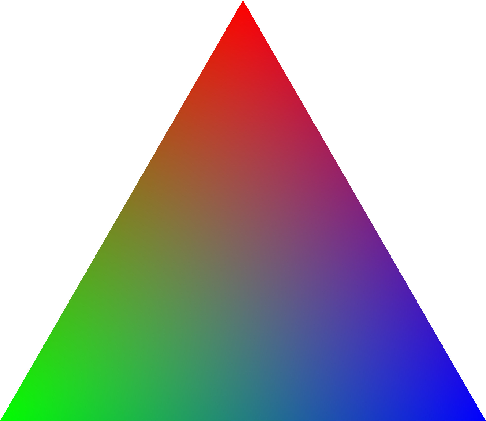
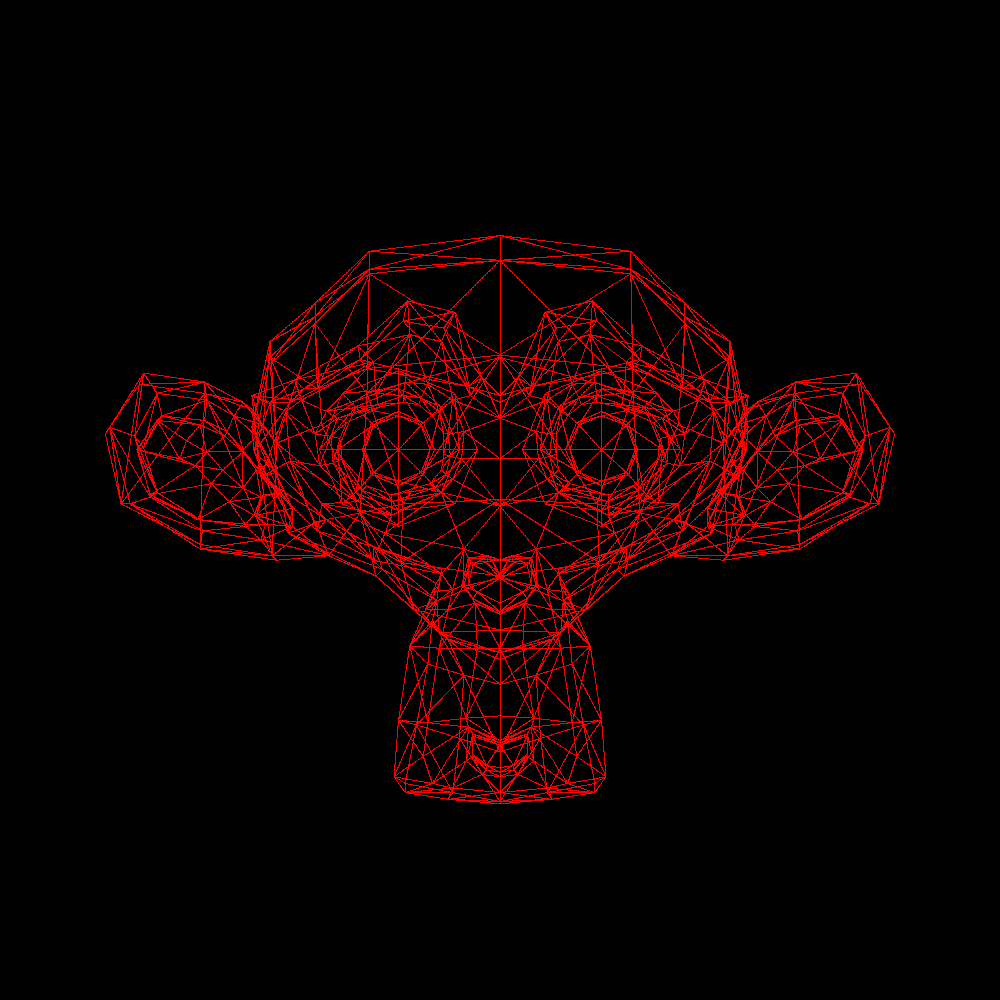
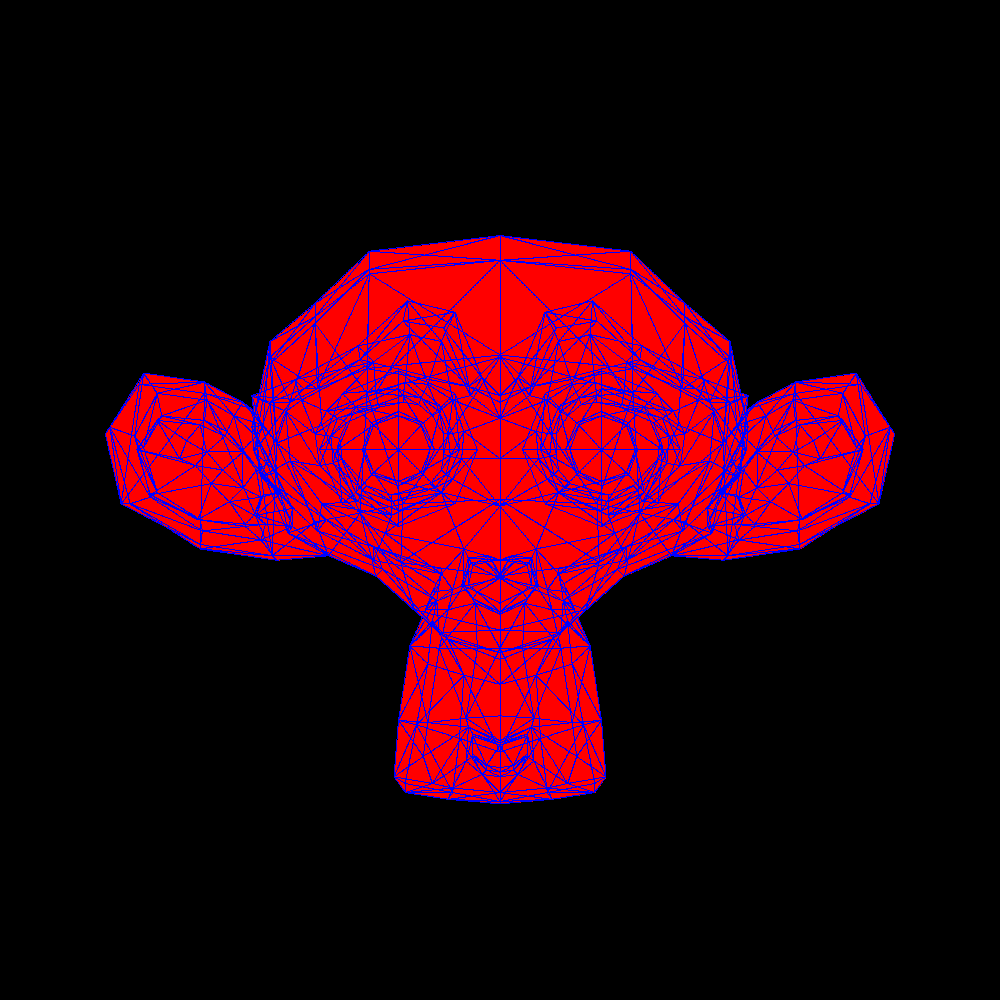

# Software Rasterization Toolkit

## Features
- File
    - Bitmap reader / writer
    - STL reader / writer
- 3DCG
    - Perspective camera
    - Rendering
        - Z-buffer (depth buffer)
    - Reflection model
        - Phong reflection model
        - Blinn phong reflection model
    - Shading
        - Flat shading
        - Gouraud shading
        - ~~Phong shading~~
- Matrix operations
    - Matrix inverse (has limitation up to 6x6)
- Vector operations
    - Barycentric coordinate system

## Building all examples
```bash
mkdir build
cd build
cmake ..
make
```

## Tips
### Export model from Blender
- File format: STL (**binary**)
- Forward: X Forward
- Up: Y Up

## Examples









### 3D models
- alice.stl (unknown author, license): "Alice and skulls free 3d model" http://3dmag.org/en/market/item/3861/
- ball.stl (Blender Foundation, unknown license): Primitives in Blender https://www.blender.org/
- cone.stl (Blender Foundation, unknown license): Primitives in Blender https://www.blender.org/
- cube.stl (me, Public Domain)
- monkey.stl (Blender Foundation, unknown license): Primitives in Blender https://www.blender.org/
- plane.stl (Blender Foundation, unknown license): Primitives in Blender https://www.blender.org/

## References
- "Article - World, View and Projection Transformation Matrices" http://www.codinglabs.net/article_world_view_projection_matrix.aspx
- "CSCI-UA-0480-006 Special Topics: Computer Graphics " https://mrl.nyu.edu/~perlin/courses/spring2019/
- "graphics - How do you determine the view-up vector? - Stack Overflow" https://stackoverflow.com/questions/21467225/how-do-you-determine-the-view-up-vector
- "mtrebi/Rasterizer: CPU forward/deferred rasterizer with depth-buffering, texture mapping, normal mapping and blinn-phong shading implemented in C++" https://github.com/mtrebi/Rasterizer
- "OpenGL Projection Matrix" http://www.songho.ca/opengl/gl_projectionmatrix.html
- "Scratchapixel" https://www.scratchapixel.com/
- "Tutorial 12 - Perspective Projection" http://ogldev.org/www/tutorial12/tutorial12.html
- "Understanding the View Matrix" https://www.3dgep.com/understanding-the-view-matrix/
